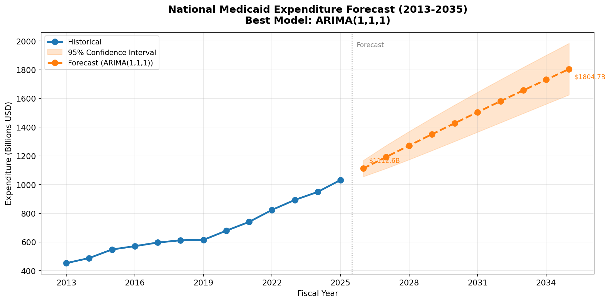
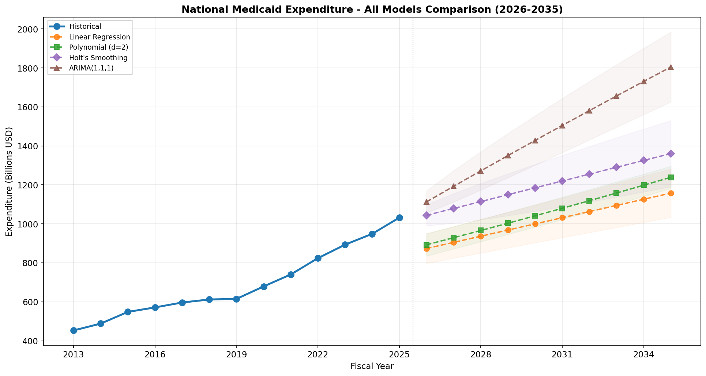

# Medicaid Expenditure Projection Model
### National + New York State | FY 2013-2025 -> Forecast 2026-2035

**Author:** Asmita Thapa  
**Date:** April 2026  

---

## Overview

This project builds a data-driven forecasting tool that analyzes 13 years of historical Medicaid expenditure data (FY 2013-2025) and generates 10-year projections (2026-2035) with 95% confidence intervals for both the United States nationally and New York State. Four forecasting models are built, evaluated, and compared. The best-performing model for each series is selected based on a hold-out test set evaluation.

The outputs are designed to support policy planning, budget allocation, and healthcare resource forecasting decisions.

---

## Project Structure

    Medicaid-Expenditure-Forecasting/
    |-- medicaid_forecastV2.ipynb
    |-- README.md
    |-- outputs/
        |-- 01_EDA_Overview.png
        |-- 02_Decomposition.png
        |-- 03_Forecast_National.png
        |-- 04_Forecast_NewYork.png
        |-- 05_AllModels_National.png
        |-- 06_AllModels_NewYork.png
        |-- Medicaid_Expenditure_Forecast_2026_2035.xlsx
        |-- National_Forecast_2026_2035.csv
        |-- NewYork_Forecast_2026_2035.csv
        |-- Medicaid_Interactive_Dashboard.html

Note: Raw source data (FY 2013-2025 MFCU Statistical Charts) are published by the U.S. Department of Health and Human Services, Office of Inspector General (OIG) and are not included in this repository. See the Data Source section for details.

---

## Setup and Installation

Install required libraries:

    pip install numpy pandas matplotlib scikit-learn scipy openpyxl jupyter

No additional packages required. ARIMA and Holt's Exponential Smoothing are implemented from first principles using numpy and scipy.

Run the notebook:

    jupyter notebook medicaid_forecast.ipynb

Before running, update the DATA_DIR variable in the second cell:

    DATA_DIR = 'your/path/to/data/folder'

---

## Data Source

The dataset consists of 13 annual Excel files published by the U.S. Department of Health and Human Services, Office of Inspector General (OIG). Each file contains state-level Medicaid expenditure data for one fiscal year.

Files used: FY_2013_MFCU_Statistical_Chart.xlsx through FY_2025_MFCU_Statistical_Chart.xlsx

Key field extracted: Total Medicaid Expenditures (state and federal shares combined)

---

## Data Cleaning Challenges

The raw Excel files presented several structural inconsistencies:

| Challenge | Solution |
|---|---|
| FY 2019 uses State1 as column name | Header row detected dynamically by keyword scan |
| FY 2016 contains a Grand Total summary row | Filtered using skip-prefix logic |
| FY 2024 Total cell contains =SUM() formula | Total row excluded; state rows summed directly |
| States count changes from 50 to 53 after FY 2019 | DC, Puerto Rico, U.S. Virgin Islands added — noted in output |
| Original code double-counted rows | Fixed by extracting only state-level rows |

---

## Methodology

### 1. Data Ingestion and Cleaning
- All 13 Excel files parsed using openpyxl in read-only mode
- Header row located dynamically — handles all naming variants across years
- Total Medicaid Expenditures column identified by keyword match
- Total and footnote rows excluded by prefix filtering
- All values converted to float; blanks and invalid entries dropped

### 2. Time Series Construction
- National: sum of all state and jurisdiction expenditures per fiscal year
- New York: filtered directly from state-level records
- Year-over-year growth rates computed for EDA

### 3. Exploratory Data Analysis
- Historical trend plots for National and New York
- Year-over-year growth rate comparison
- New York share of national expenditure over time
- Time series decomposition into trend and residual components
- Descriptive statistics including min, max, mean, median, std deviation

### 4. Forecasting Models

All models use a train/test split:
- Training set: FY 2013-2021
- Test set: FY 2022-2025 (hold-out, never seen during training)

| Model | Description |
|---|---|
| Linear Regression | OLS on Year as predictor. Prediction intervals use t-distribution leverage formula that widens with forecast horizon. |
| Polynomial Regression (d=2) | Quadratic OLS. Captures non-linear acceleration in spending growth. |
| Holt's Exponential Smoothing | Double exponential smoothing with level (alpha) and trend (beta) optimised by minimising SSE. CI widens as sqrt(h). |
| ARIMA(1,1,1) | AR and MA parameters estimated by conditional least squares on first differences. Uncertainty grows as sqrt(h). |

### 5. Model Evaluation

| Metric | Description |
|---|---|
| MAE | Mean Absolute Error |
| RMSE | Root Mean Squared Error |
| MAPE | Mean Absolute Percentage Error — used for model selection |

---

## Results

### Model Performance — National (Test: FY 2022-2025)

| Rank | Model | MAE | RMSE | MAPE |
|---|---|---|---|---|
| 1 | ARIMA(1,1,1) | $33.7B | $35.5B | 3.6% |
| 2 | Holt's Exponential Smoothing | $107.6B | $113.8B | 11.4% |
| 3 | Polynomial Regression (d=2) | $120.4B | $126.1B | 12.8% |
| 4 | Linear Regression | $129.9B | $136.2B | 13.8% |

### Model Performance — New York (Test: FY 2022-2025)

| Rank | Model | MAE | RMSE | MAPE |
|---|---|---|---|---|
| 1 | Linear Regression | $13.0B | $13.9B | 13.4% |
| 2 | Holt's Exponential Smoothing | $20.7B | $21.8B | 21.4% |
| 3 | ARIMA(1,1,1) | $22.0B | $23.2B | 22.8% |
| 4 | Polynomial Regression (d=2) | $29.9B | $31.9B | 30.8% |

### National 10-Year Forecast — ARIMA(1,1,1)

| Fiscal Year | Forecast | Lower 95% CI | Upper 95% CI |
|---|---|---|---|
| 2026 | $1,112.6B | $1,055.9B | $1,169.2B |
| 2027 | $1,192.6B | $1,112.4B | $1,272.8B |
| 2028 | $1,271.8B | $1,173.6B | $1,370.0B |
| 2029 | $1,350.3B | $1,236.9B | $1,463.6B |
| 2030 | $1,427.9B | $1,301.2B | $1,554.7B |
| 2031 | $1,504.8B | $1,366.0B | $1,643.7B |
| 2032 | $1,580.9B | $1,431.0B | $1,730.9B |
| 2033 | $1,656.3B | $1,496.0B | $1,816.6B |
| 2034 | $1,730.9B | $1,560.8B | $1,900.9B |
| 2035 | $1,804.7B | $1,625.5B | $1,984.0B |

### New York 10-Year Forecast — Linear Regression

| Fiscal Year | Forecast | Lower 95% CI | Upper 95% CI |
|---|---|---|---|
| 2026 | $87.6B | $61.3B | $114.0B |
| 2027 | $90.0B | $62.1B | $118.0B |
| 2028 | $92.5B | $62.8B | $122.2B |
| 2029 | $94.9B | $63.5B | $126.4B |
| 2030 | $97.4B | $64.1B | $130.7B |
| 2031 | $99.8B | $64.7B | $134.9B |
| 2032 | $102.2B | $65.2B | $139.3B |
| 2033 | $104.7B | $65.8B | $143.6B |
| 2034 | $107.1B | $66.3B | $148.0B |
| 2035 | $109.6B | $66.7B | $152.4B |

---

## Key Observations

- National Medicaid spending nearly doubled from $453B in FY 2013 to $1.03T in FY 2025, an average annual growth rate of 7.2%.
- New York grew from $54B to $103B over the same period at 5.5% average annual growth (CAGR).
- ARIMA(1,1,1) outperforms all models nationally with MAPE of 3.6%, because national Medicaid spending follows strong year-to-year momentum.
- Linear Regression performs best for New York (MAPE 13.4%) because NY follows a consistent long-term upward trend despite some volatility.
- Polynomial Regression failed for New York, producing negative forecasts by 2033 due to overfitting. This highlights why hold-out test evaluation is essential.
- FY 2019 shows a notable dip in New York spending ($60.2B vs $75.3B in FY 2018), likely reflecting a policy or reporting change. Retained in analysis as real observed data.
- The COVID-19 period (FY 2020-2021) shows acceleration in national spending driven by Medicaid enrollment expansion.

---

## Deliverables

| File | Description |
|---|---|
| medicaid_forecast.ipynb | Full reproducible Jupyter notebook |
| 01_EDA_Overview.png | 4-panel exploratory data analysis |
| 02_Decomposition.png | Time series decomposition |
| 03_Forecast_National.png | National best-model forecast with 95% CI |
| 04_Forecast_NewYork.png | New York best-model forecast with 95% CI |
| 05_AllModels_National.png | All 4 models overlaid — national |
| 06_AllModels_NewYork.png | All 4 models overlaid — New York |
| Medicaid_Expenditure_Forecast_2026_2035.xlsx | 7-sheet Excel with forecasts, model comparison, and historical data |
| National_Forecast_2026_2035.csv | National forecast table |
| NewYork_Forecast_2026_2035.csv | New York forecast table |
| Medicaid_Interactive_Dashboard.html | Interactive dashboard — open in Chrome or Edge |